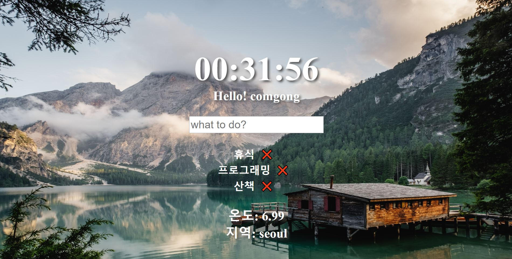
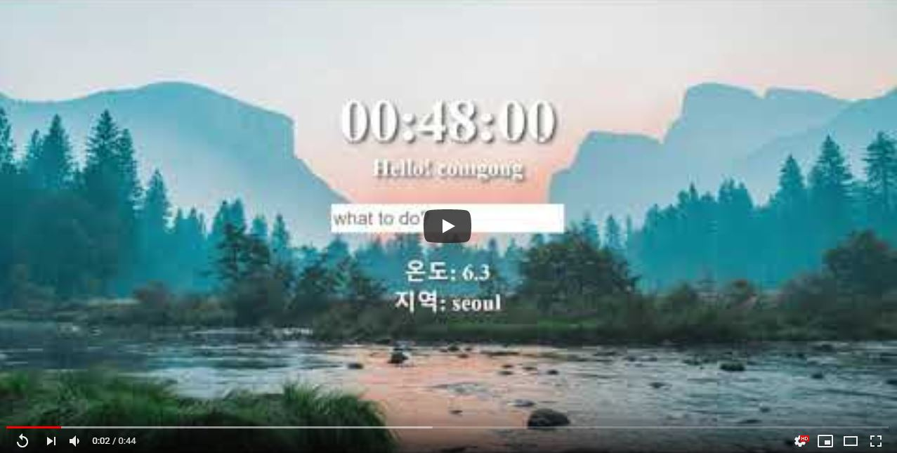

## clock made by Vanila JS.

### Result

### Video

### Data Storage
#### Local Storage on Web Browser
* Stored Data
  * username
  * GeoLocation
  * ToDo item

### Web API
* open weather map
  * [https://openweathermap.org](https://openweathermap.org)
